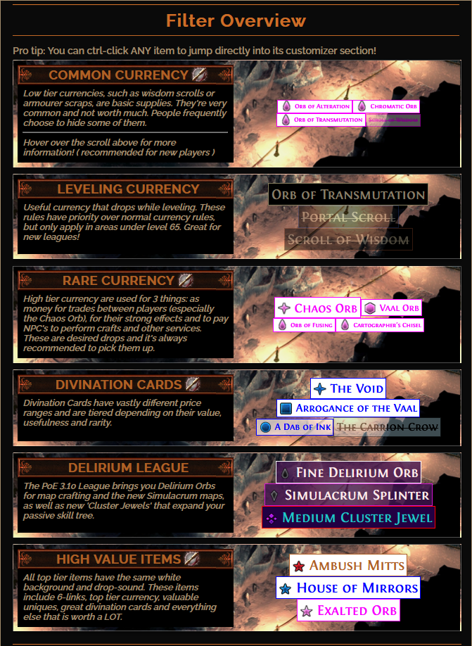

# PoE-Mokeys-Custom-Filter
Mokey's Custom Path of Exile Loot Filter, Created through Filter Blade.

*image taken via FilterBlades Website*

<h1>How to Install:</h1>

<h2>Auto Sync / Follow  (*preferred Method*) </h2>

* Navigate to https://www.pathofexile.com/item-filter/E4X9Ksj

* Log in with your Path of Exile Account. (*If you are a steam user, you will have to create an account and link your steam account to your Path of Exile Account*)

* Click Follow in the Top Right hand Corner

1: Go to game

2: Press (*default*) "**ESC**" to get to your game menu.

3: Click "**Options**".

4: Select the "**UI**" Tab.

5: Scroll down to **List of Item Filters**. 

6: Select the dropdown menu.

7: Select **Mokeys Custom Filter**,\, 

8: Click the **Refresh** Symbol.

You should now see a notification that it has loaded. If you recieve an error, you will need to download the audio files from GitHub.

<h2>Manual Install</h2>

* Go to the [github's .filter code](https://github.com/MokeyII/PoE-Mokeys-Custom-Filter/blob/master/MokeysCustomFilter.filter) **OR** get the most updated code @ https://www.pathofexile.com/item-filter/E4X9Ksj

* Copy _ALL_ of the code

* Paste the code into Notepad

* Save the file to your Path of Exile Saved Folder, typically this resides in "C:\Users\ %USERNAME% \Documents\My Games\Path of Exile\

1: Go to game

2: Press (*default*) "**ESC**" to get to your game menu.

3: Click "**Options**".

4: Select the "**UI**" Tab.

5: Scroll down to **List of Item Filters**. 

6: Select the dropdown menu.

7: Select **Mokeys Custom Filter**,\, 

8: Click the **Refresh** Symbol.

You should now see a notification that it has loaded. If you recieve an error, you will need to download the audio files from GitHub.

Additional Information can be found @ https://pathofexile.gamepedia.com/Item_filter

---
All Images and File Setups are set up with filterblade https://www.filterblade.xyz/ I do not an will not take credit for any of the work Filterblade has done. This File is to simply Share my Filter with other people and to show updates to my filters easily.
